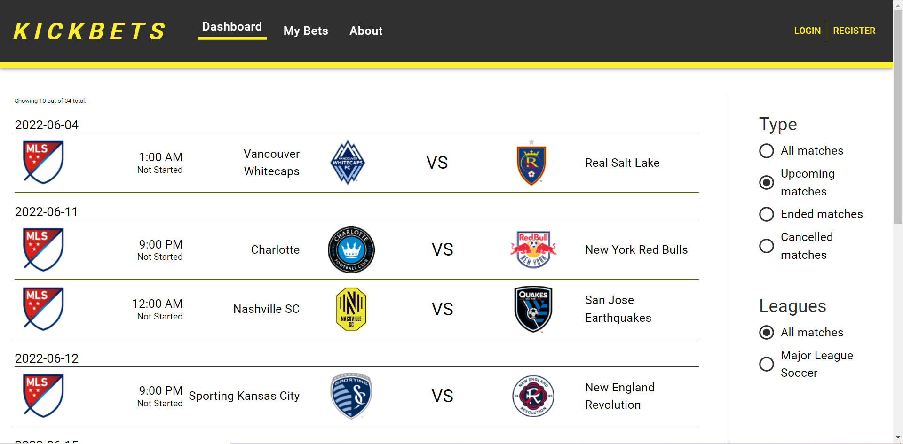
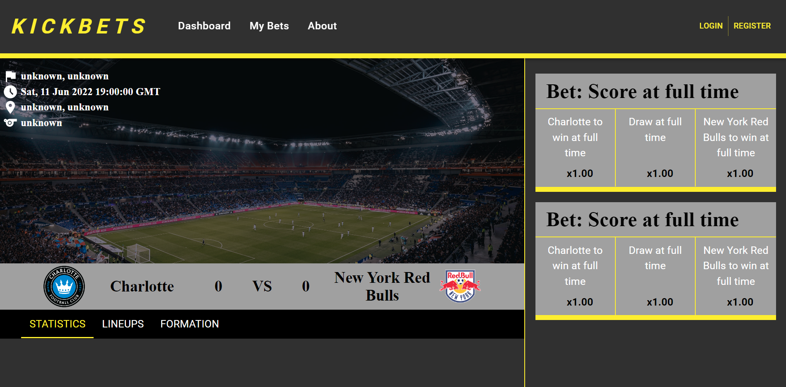
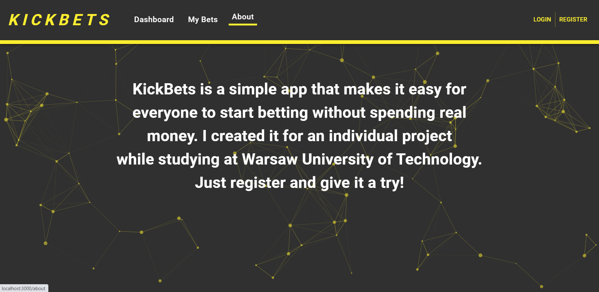
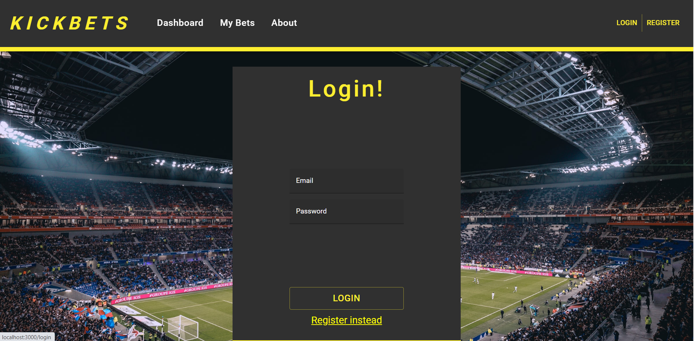

# KickBets

KickBets is a simple app that makes it easy for
everyone to start betting without spending real
money. I created it for an individual project
while studying at Warsaw University of Technology.

## Demo

https://kickbets.azurewebsites.net/

## Tech Stack

**Client:** React, MobX, MaterialUI

**Server:** ASP.NET Core

## Usage/Examples

You can run it using docker:
 - change section "CurrentConnectionString" in appsettings.json in Api project "DockerConnectionString"
 - setup "ApiFootball" section with league ids you want to track and rapid api key for API-Football (https://www.api-football.com/)
 - run docker-compose build in project root
 - run docker-compose up in project root
## Screenshots

